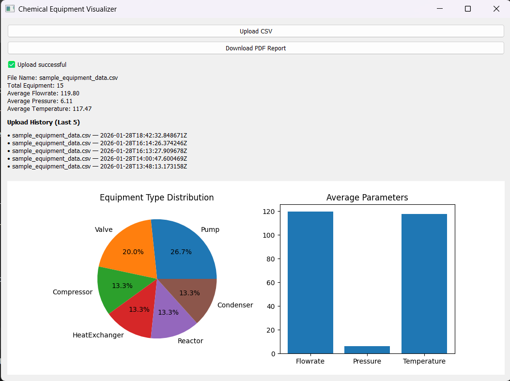
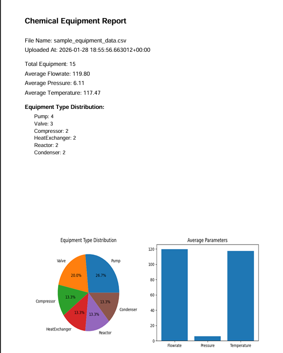

# Chemical Equipment Parameter Visualizer

## Overview

This project was developed as part of the **FOSSEE Semester Long Internship – 2026 screening task**.

The objective of the assignment is to design and implement a **hybrid Web + Desktop application** that demonstrates:

* clean backend API design,
* correct data handling and analysis, and
* consistent visualization across multiple client platforms.

The application allows users to upload a CSV file containing chemical equipment parameters. The backend processes the data and exposes analytical results through REST APIs, which are consumed by both the Web and Desktop applications.

The emphasis of this project is on **correctness, clarity, and reusability of logic**, rather than advanced UI styling.

---

## Key Features

* Upload CSV files containing chemical equipment data
* Backend analytics using Pandas
* Summary statistics:

  * Total equipment count
  * Average flowrate, pressure, temperature
  * Equipment type distribution
* Data visualization:

  * Pie chart (equipment type distribution)
  * Bar chart (average parameters)
* History management (last 5 uploads)
* PDF report generation (includes charts)
* Basic authentication
* Same backend used by Web and Desktop clients

---

## Tech Stack

### Backend

* Python
* Django
* Django REST Framework
* Pandas
* Matplotlib
* ReportLab
* SQLite

### Web Frontend

* React (Vite)
* Axios
* Chart.js

### Desktop Frontend

* PyQt5
* Requests
* Matplotlib

---

## Project Structure

```
chemical-equipment-visualizer/
│
├── backend/
│   ├── api/
│   │   ├── models.py
│   │   ├── views.py
│   │   ├── serializers.py
│   │   ├── pdf_utils.py
│   │   └── urls.py
│   ├── config/
│   ├── venv/
│   └── manage.py
│
├── web-frontend/
│   ├── src/
│   │   ├── components/
│   │   └── api.js
│   └── package.json
│
├── desktop-app/
│   ├── main.py
│   ├── api.py
│   └── venv/
│
├── sample_equipment_data.csv
└── README.md
```

---

## CSV Format

The uploaded CSV file must contain the following columns:

```
Equipment Name, Type, Flowrate, Pressure, Temperature
```

Example:

```
Pump-1, Pump, 120, 3.5, 60
Valve-2, Valve, 80, 2.1, 45
```

---

## Backend Setup

### 1. Create virtual environment

```bash
cd backend
python -m venv venv
venv\Scripts\activate
```

### 2. Install dependencies

```bash
python -m pip install django djangorestframework pandas matplotlib reportlab django-cors-headers
```

### 3. Run migrations

```bash
python manage.py makemigrations
python manage.py migrate
```

### 4. Create user (for Basic Auth)

```bash
python manage.py createsuperuser
```

### 5. Run backend server

```bash
python manage.py runserver
```

### 6. Backend runs at:

```
http://127.0.0.1:8000/
```
### 7. SampleCurrently Deployed at : 
```
https://chemical-equipment-backend-xthm.onrender.com
```
---

## 🔑 Evaluation Credentials
For testing and evaluation purposes, use the following demo account:

> **Username:** `fossee`  
> **Password:** `fossee123`
---

## API Endpoints

| Endpoint      | Method | Description            |
| ------------- | ------ | ---------------------- |
| /api/upload/  | POST   | Upload CSV file        |
| /api/summary/ | GET    | Latest dataset summary |
| /api/history/ | GET    | Last 5 uploads         |
| /api/report/  | GET    | Download PDF report    |

All APIs are protected using **Basic Authentication**.

---

## Web Frontend Setup (React)


```bash
cd web-frontend
npm install
npm run dev
```

Web app runs at:

```
http://localhost:5173
```

Features:

* CSV upload
* Summary display
* Charts using Chart.js
* Upload history
* PDF download

---

## Desktop App Setup (PyQt5)



```bash
cd desktop-app
python -m venv venv
venv\Scripts\activate
python -m pip install pyqt5 requests matplotlib
python main.py
```

Desktop features mirror the web app:

* CSV upload
* Summary display
* Charts using Matplotlib
* Upload history (last 5)
* PDF download

---

## PDF Report



The generated PDF includes:

* Dataset metadata
* Summary statistics
* Pie chart (equipment type distribution)
* Bar chart (average parameters)

The same report is accessible from:

* Web frontend
* Desktop application

---

## UI/UX Consistency

* Same backend APIs for Web and Desktop
* Same data fields and naming
* Same analytics logic
* Equivalent charts across platforms

Styling is intentionally kept simple to focus on clarity and functionality.

---

## Demo Video

A short demo video (2–3 minutes) is provided to demonstrate the complete workflow:

1. Running the Django backend
2. CSV upload from the Web application
3. Display of summary statistics and charts
4. PDF report download
5. CSV upload from the Desktop application
6. Desktop visualization and PDF download

---

## Notes for Evaluators

* The backend acts as a single source of truth for all computations
* CSV parsing and analytics are performed only on the backend
* Frontend applications consume pre-computed results via REST APIs
* Both Web and Desktop clients share the same data flow and logic

This design ensures consistency, avoids duplication of logic, and reflects real-world client–server architecture.

---

## Author

Built by **Krishna** as part of the FOSSEE Semester Long Internship – 2026 screening task.

---

Thank you for reviewing this submission.
